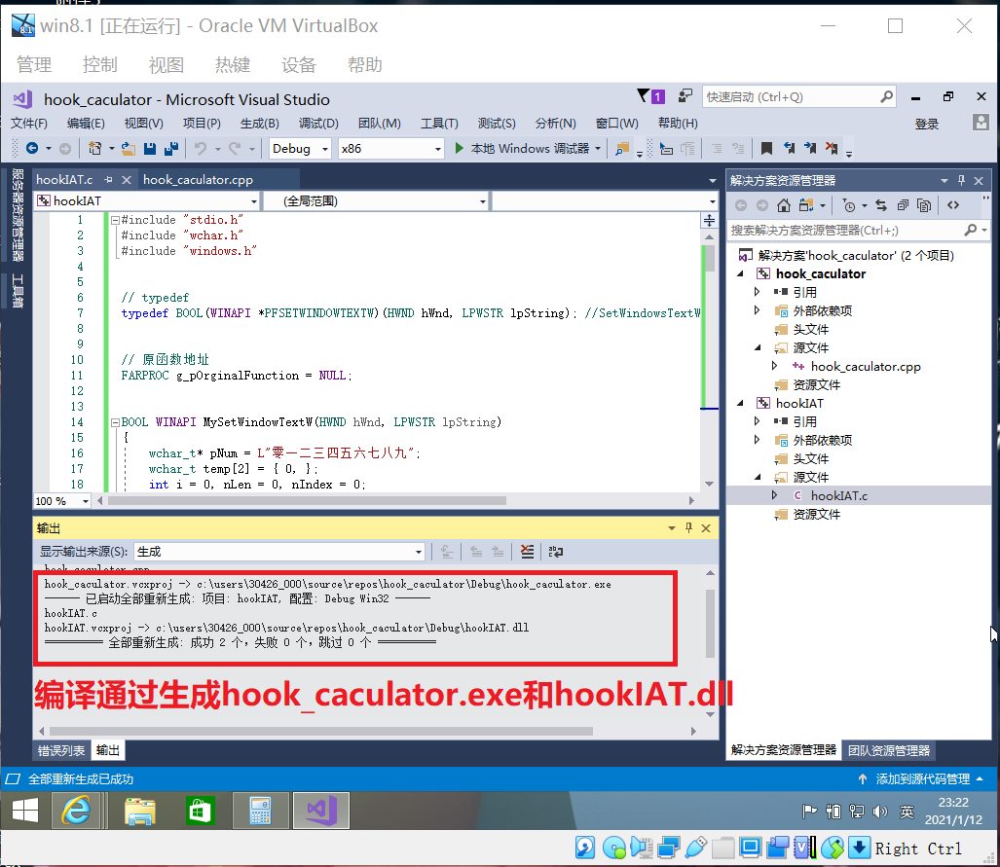
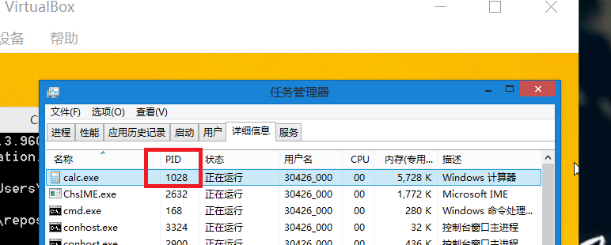
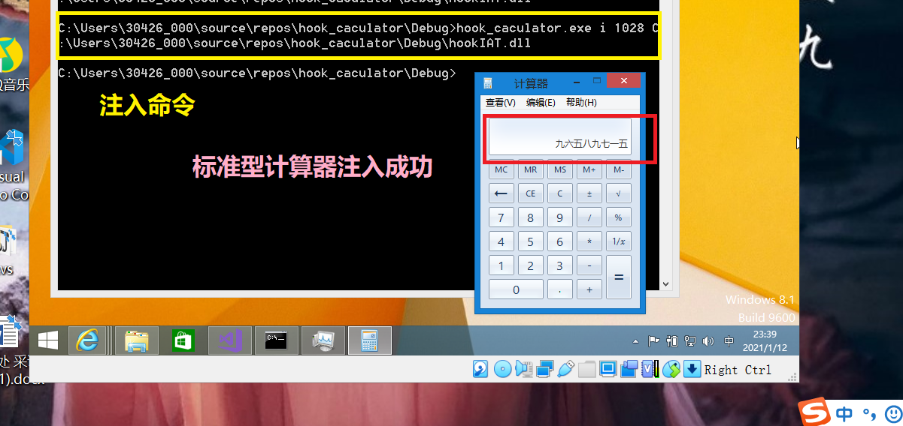
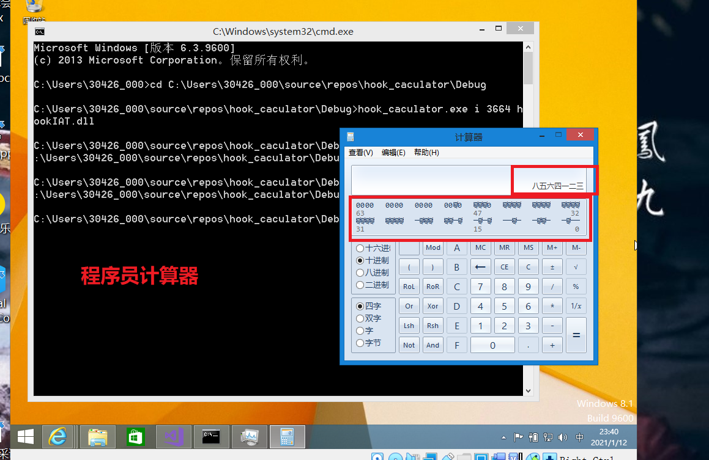
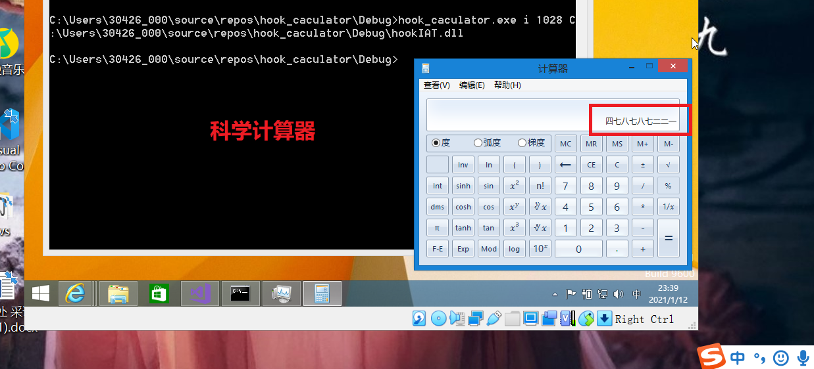
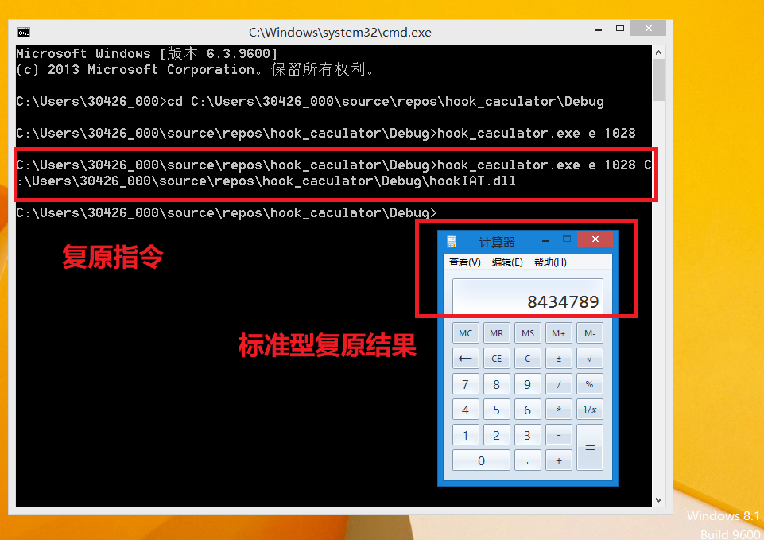
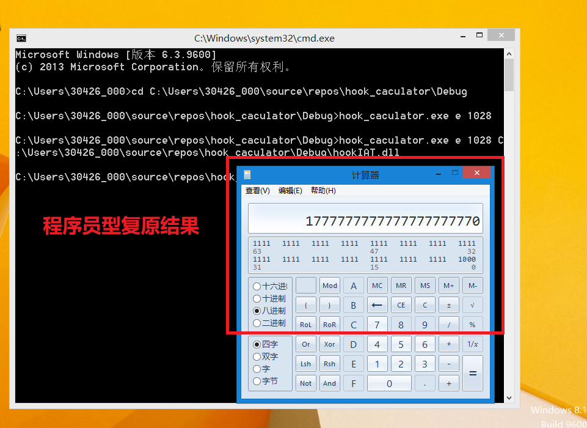

## 使用IAThook向计算器注入DLL，使数字显示为中文


### 实验环境
Window8.1(x86)


### 实验过程

- 代码项目有两个`Hook_caculator`和`hookIAT`,前者项目属性设置生成.exe文件，后者项目属性设置生成DLL动态库。
    (具体代码见仓库)


- 注入方式：**命令行传参注入**
    ```
    语法：- USAGE : hook_caculator.exe <i|e> <PID> <dll_path>
    i 使计算器显示中文数字
    e 使计算器恢复阿拉伯数字
    ```

- 打开计算器，查看计算器进程号PID之后，开始在命令行注入


- 注入成功，结果展示




- 将calc的IAT恢复原值




#### 遇到的问题
- 程序使用x86的编译器可以正常编译通过，但本机是64位的，使用x64的编译器，dll生成报错:
    ```
    MSVCRTD.lib(exe_winmain.obj) : error LNK2019: 无法解析的外部符号 WinMain，该符号在函数 "int __cdecl invoke_main(void)" (?invoke_main@@YAHXZ) 中被引用
    C:\Users\30426\source\repos\Hook_caculator\x64\Debug\Hookiat.exe : fatal error LNK1120: 1 个无法解析的外部命令
    ```
    尝试修改字符集，使用控制台程序等，未解决报错，本机不能完成实验
    又安装了8.1系统的虚拟机来完成(又探索了一遍虚拟机的安装使用、增强功能安装)