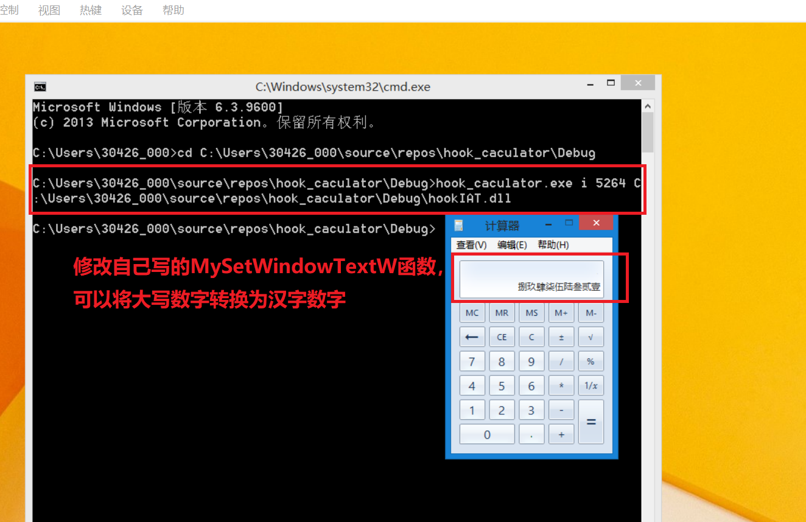

## 使用IAThook向计算器注入DLL，使数字显示为中文


### 实验环境
Window8.1(x86)


### 实验过程

- 代码项目有两个`Hook_caculator`和`hookIAT`,前者项目属性设置生成.exe文件，后者项目属性设置生成DLL动态库。
    (具体代码见仓库)


- 注入方式：**命令行传参注入**
    ```
    语法：- USAGE : hook_caculator.exe <i|e> <PID> <dll_path>
    i 使计算器显示中文数字
    e 使计算器恢复阿拉伯数字
    ```

- 打开计算器，查看计算器进程号PID之后，开始在命令行注入


- 注入成功，结果展示


- 将calc的IAT恢复原值


### 实验原理

- IAT HOOK的**基本原理**
    ```
    假设想要对IAT进行HOOK，那么大概须要三个步骤，首先是获取要HOOK函数的地址，第二步是找到该函数所保存的IAT中的地址，最后一步是把IAT中的地址改动为HOOK函数的地址，这样就完成了IAT HOOK。
    ```

- 本实验要HOOK的模块为user32.dll中的SetWindowTextW()函数，首先是获得该函数的地址，第二步是找到SetWindowTextW()所保存的IAT地址，最后一步是把IAT中的SetWindowTextW()函数的地址改动为自己编写的HOOK函数的地址。

- IAT HOOK的**编码实现**
    ```
    建立一个简单的DLL文件，然后定义好DLL文件的主函数，并定义一个hook_iat()函数，在DLL被进程载入的时候，首先保存原始API函数的地址，便于之后的恢复，然后让DLL文件去调用hook_iat()函数；当进程被卸载的时候，利用之前保存的API函数地址，恢复原始状态。
    ```
    ```
    BOOL WINAPI DllMain(HINSTANCE hinstDLL, DWORD fdwReason, LPVOID lpvReserved)
    {
        switch( fdwReason )
        {
                // 当DLL被某进程载入时DllMain被调用
                case DLL_PROCESS_ATTACH : 
                        // 保存原始的API函数地址
                        g_pOrgFunc = GetProcAddress(GetModuleHandleW(L"user32.dll"), 
                                                   "SetWindowTextW");
                        // 运行Hook函数
                        hook_iat("user32.dll", g_pOrgFunc, (PROC)MySetWindowTextW);
                        break;
                // 当DLL被某进程卸载时DllMain被调用
                case DLL_PROCESS_DETACH :
                        // 解除hook函数
                        hook_iat("user32.dll", (PROC)MySetWindowTextW, g_pOrgFunc);
                        break;
        }
        return TRUE;
    }
    ```

- 本实验采用自己编写的MySetWindowTextW函数来代替user32.dll中的SetWindowTextW的函数，也是在该函数中实现将数字变成中文数字的功能，具体功能及代码解释：
    ```
    lpString参数是一块缓冲区，该缓冲区用来存放要输出显示的字符串。for循环将存放在lpString的阿拉伯数字字符串转换为中文数字字符串。for循环结束后，最后再调用函数指针g_pOrgFunc。
    ```
    ```
    BOOL WINAPI MySetWindowTextW(HWND hWnd, LPWSTR lpString)
    {
	    //wchar_t* pNum = L"零一二三四五六七八九";
	    wchar_t* pNum = L"零壹贰叁肆伍陆柒捌玖";
	    wchar_t temp[2] = { 0, };
	    int i = 0, nLen = 0, nIndex = 0;

	    nLen = wcslen(lpString);
	    for (i = 0; i < nLen; i++)
	    {
		    //   将阿拉伯数字转换为中文数字  
		    //   lpString是宽字符版本(2个字节)字符串  
		    if (L'0' <= lpString[i] && lpString[i] <= L'9')
		    {
			    temp[0] = lpString[i];
			    nIndex = _wtoi(temp);
			    lpString[i] = pNum[nIndex];
		    }
	    }

	    //   调用原函数；user32.SetWindowTextW  
	    //   (修改lpString缓冲区中的内容)  
	    return ((PFSETWINDOWTEXTW)g_pOrginalFunction)(hWnd, lpString);
    }
    ```

- 通过更改上述函数内容，还可以显示大写的汉字数字

其余步骤同上不再展示


#### 遇到的问题
- 程序使用x86的编译器可以正常编译通过，但本机是64位的，使用x64的编译器，dll生成报错:
    ```
    MSVCRTD.lib(exe_winmain.obj) : error LNK2019: 无法解析的外部符号 WinMain，该符号在函数 "int __cdecl invoke_main(void)" (?invoke_main@@YAHXZ) 中被引用
    C:\Users\30426\source\repos\Hook_caculator\x64\Debug\Hookiat.exe : fatal error LNK1120: 1 个无法解析的外部命令
    ```
    尝试修改字符集，使用控制台程序等，未解决报错，本机不能完成实验
    又安装了8.1系统的虚拟机来完成(又探索了一遍虚拟机的安装使用、增强功能安装)