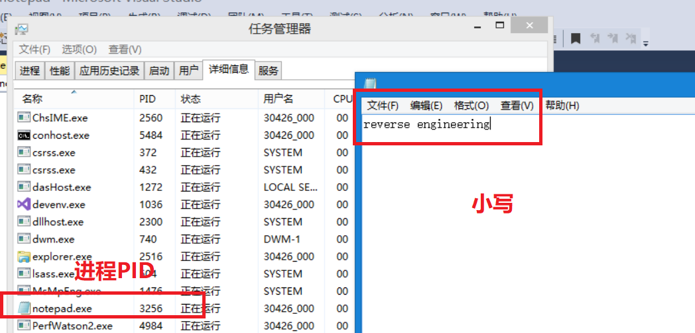
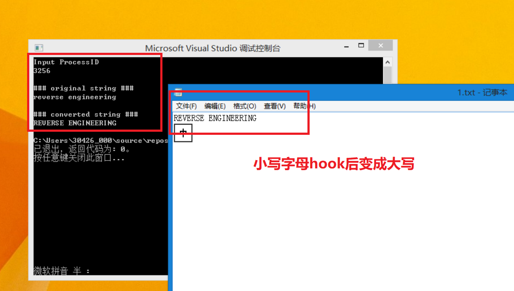

## IATHook之记事本小写转大写

### 实验环境
- window8.1(x86)
- 32位的notepad.exe

### 实验原理

- 基本原理：在记事本调用kernel32.dll中的WriteFile函数之前设置断点，将记事本内容的小写全部改为大写之后，再重新调用WriteFile函数完成保存操作。
- 过程：
    + 对notepad.exe进行附加操作，使进程成为被调试者。
    + Hook:将Writefile API起始的第一个字节修改成0xcc 也就是int3  断点。
    + 保存文件时，控制权转移到调试器上，这时将所有的小写文字改成大写
    + 脱钩： 将0xcc恢复成原本的字节，继续正常运行
    + 控制权返还给notepad.exe。

### 实验过程

- 执行Hook_notepad.exe

- 在记事本中输入对应的内容，在命令行中输入记事本对应的PID号

- 保存，完成Hook



#### 关键函数解释

- **DebugLoop**函数(把进程捆绑到调试器上)
    ```
    void DebugLoop()
    {
        DEBUG_EVENT de;
        DWORD dwContinueStatus;
        //等待被调式事件发生
        while (WaitForDebugEvent(&de, INFINITE))//获取调试事件存放到de里，等待的毫秒数为默认值
        {
            dwContinueStatus = DBG_CONTINUE;
            //被调试进程生成或附加事件
            if (CREATE_PROCESS_DEBUG_EVENT == de.dwDebugEventCode)//创建进程调试事件
            {
                OnCreateProcessDebugEvent(&de);
            }
            //异常事件
            else if (EXCEPTION_DEBUG_EVENT == de.dwDebugEventCode)//异常调试事件
            {
                if (OnExcptionDebugEvent(&de))
                    continue;
            }
            //被调试进程终止事件
            else if (EXIT_PROCESS_DEBUG_EVENT == de.dwDebugEventCode)//进程退出调试事件
            {
                //被调试这终止，调试器终止
                break;
            }
            ContinueDebugEvent(de.dwProcessId, de.dwThreadId, dwContinueStatus);//到这里被调试的进程正常运行
        }
    }
    ```
    该循环用来等待异常事件，对创建进程调试事件，异常调试事件，进程退出调试事件添加处理。
    被调试进程终止时触发： EXIT_PROCESS_DEBUG_EVENT
    被调试事件启动时触发：CREATE_PROCESS_DEBUG_EVENT

+ 在CREATE_PROCESS_DEBUG_EVENT事件发生执行**OnCreateProcessDebugEvent**函数
    ```
    BOOL OnCreateProcessDebugEvent(LPDEBUG_EVENT pde)
    {
        //获取WriteFile的API地址
        g_pfWriteFile = GetProcAddress(GetModuleHandle((LPCWSTR)"kernel32.dll"),"WriteFile");
        //API钩子 - WriteFile
        //更改第一个字节位0xcc
        //originalbyte是g_ch0rgByte的备份
        memcpy(&g_cpdi, &pde->u.CreateProcessInfo, sizeof(CREATE_PROCESS_DEBUG_INFO));
        ReadProcessMemory(g_cpdi.hProcess, g_pfWriteFile, &g_chorgByte, sizeof(BYTE), NULL);//CREATE_PROCESS_DEBUG_INFO的hProcess是被调试进程的句柄
        WriteProcessMemory(g_cpdi.hProcess, g_pfWriteFile,&g_chINT3, sizeof(BYTE), NULL);//设置断点1.保存原本数据。2.向指令处写入0xcc(也就是INT 3)
    }
    ```
    先获取到kernel32.dll中的WriteFile函数的地址,拷贝原本的CREATE_PROCESS_DEBUG_INFO结构(防止数据被修改造成句柄等结构丢失)。然后设置断点。这样当被调试进程调用WriteFile API时控制权会转移给调试器。

+ 当执行int 3指令会触发EXCEPTION_DEBUG_EVENT，调用**OnExceptionDebugEvent**函数
    ```
    BOOL OnExceptionDebugEvent(LPDEBUG_EVENT pde)
    {
        CONTEXT ctx;
        PBYTE lpBuffer = NULL;
        DWORD dwNumOfBytesToWrite, dwAddrOfBuffer, i;
        EXCEPTION_RECORD *per = &pde->u.Exception.ExceptionRecord;//异常记录
        //是断点int 3时
        if (EXCEPTION_BREAKPOINT == per->ExceptionCode)
        {
            //断点地址位WriteFile()API地址时
            if (g_pfWriteFile == per->ExceptionAddress)
            {
                //Unhook
                //将0xcc回复位orignal byte
                WriteProcessMemory(g_cpdi.hProcess, g_pfWriteFile, &g_chorgByte, sizeof(BYTE), NULL);
                //获取线程上下文
                ctx.ContextFlags = CONTEXT_CONTROL;
                GetThreadContext(g_cpdi.hThread, &ctx);//获取context的内容

                //获取WriteFile的参数2，3值
                ReadProcessMemory(g_cpdi.hProcess, (LPVOID)(ctx.Esp + 0x8), &dwAddrOfBuffer, sizeof(DWORD), NULL);//获取WriteFile的第二个参数   这里的2个写入的硬长度只是决定了注入的不能是64位的
                ReadProcessMemory(g_cpdi.hProcess, (LPVOID)(ctx.Esp + 0xC), &dwNumOfBytesToWrite, sizeof(DWORD), NULL);//获取WriteFile的第三个参数
                //分配临时缓冲区
                lpBuffer = (PBYTE)malloc(dwNumOfBytesToWrite + 1);
                memset(lpBuffer, 0, dwNumOfBytesToWrite);//申请空间，初始化为0
                //复制WriteFile缓冲区到临时缓冲区
                ReadProcessMemory(g_cpdi.hProcess, (LPVOID)dwAddrOfBuffer, lpBuffer, dwNumOfBytesToWrite, NULL);//被调试进程栈里面存的第二个参数是一个地址，这里把数据读取出来放进缓冲区
                printf("\n### original string : %s\n", lpBuffer);

                //将小写字母转化为大写字母
                for (i = 0; i < dwNumOfBytesToWrite; i++)
                {
                    if (0x61 <= lpBuffer[i] && lpBuffer[i] <= 0x7A)
                    {
                        lpBuffer[i] -= 0x20;
                    }
                }
                printf("\n###coverted string : %s\n", lpBuffer);
                //将变化后的缓冲区复制到WriteFile()缓冲区
                WriteProcessMemory(g_cpdi.hProcess, (LPVOID)dwAddrOfBuffer, lpBuffer, dwNumOfBytesToWrite, NULL);//写入到内存地址
                //释放临时缓冲区
                free(lpBuffer);

                //将线程上下文的EIP更改为WriteFile的首地址
                ctx.Eip = (DWORD)g_pfWriteFile; //位置为INT 3执行之后所以要修改EIP
                SetThreadContext(g_cpdi.hThread, &ctx);

                //运行被调试程序
                ContinueDebugEvent(pde->dwProcessId, pde->dwThreadId, DBG_CONTINUE);
                Sleep(0);
                
                //APIHook
                WriteProcessMemory(g_cpdi.hProcess, g_pfWriteFile, &g_chINT3, sizeof(BYTE), NULL);
                return TRUE;
            }
        }
        return TRUE;
    }

    ```
    + 验证断点位置是否是WriteFile的起始地址
    + 脱钩–把之前写入的0xcc恢复（用WriteProceessMemory函数）
    + 获取被调试进程的上下文（用GetThreadText函数）
    + 用ReadProcessMemory函数读栈内的第二第三个参数，注意这里获取到的 LPVOID lpBuffer 是一个指针
    + 分配调试器的缓冲区，并用ReadProcessMemory函数把数据从3得到的指针中获取到缓冲区中
    + 把缓冲区中字母小写转大写
    + 用WriteProcessMemory将变化后的数据写入到原本的地址中
    + 将被调试进程的EIP重新返回到WriteFile()API的首地址（用SetThreadContext函数）。
    + 用ContinueDebugEvent函数让被调试程序继续运行
    + 用WriteProcessMemory重新写入INT 3指令即放入钩子。
    + Sleep(0);作用是释放掉CPU当前正在执行的被调函数的时间片，不释放的话可能会引起内存访问冲突。

